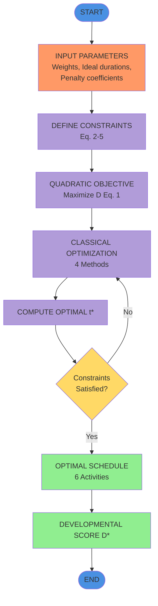

# Flow Diagram for Paper

## Option 1: Simple Text-Based Flowchart (Can paste directly in paper)

```
┌─────────────────────────────────────────────────────────┐
│                        START                             │
└────────────────────────┬────────────────────────────────┘
                         │
                         ▼
┌─────────────────────────────────────────────────────────┐
│              INPUT PARAMETERS                            │
│  • Weights (wᵢ), Ideal durations (μᵢ)                   │
│  • Penalty coefficients (aᵢ)                             │
│  • Activity bounds (Lᵢ, Uᵢ)                             │
│  • Pediatric guidelines                                  │
└────────────────────────┬────────────────────────────────┘
                         │
                         ▼
┌─────────────────────────────────────────────────────────┐
│            DEFINE CONSTRAINTS                            │
│  • Σtᵢ = 24 hrs (Eq. 2)                                 │
│  • Lᵢ ≤ tᵢ ≤ Uᵢ for all i (Eq. 3)                      │
│  • 0.5 ≤ (t₃+t₄)/t₂ ≤ 2.5 (Eq. 4)                      │
│  • tᵢ ≥ 0 for all i (Eq. 5)                             │
└────────────────────────┬────────────────────────────────┘
                         │
                         ▼
┌─────────────────────────────────────────────────────────┐
│          QUADRATIC OBJECTIVE FUNCTION                    │
│  Maximize D = Σwᵢ[-aᵢ(tᵢ-μᵢ)² + cᵢ] (Eq. 1)           │
│  Subject to constraints                                  │
└────────────────────────┬────────────────────────────────┘
                         │
                         ▼
┌─────────────────────────────────────────────────────────┐
│        CLASSICAL OPTIMIZATION METHODS                    │
│  • Steepest Descent                                      │
│  • Newton's Method                                       │
│  • BFGS (Quasi-Newton)                                   │
│  • Conjugate Gradient                                    │
└────────────────────────┬────────────────────────────────┘
                         │
                         ▼
┌─────────────────────────────────────────────────────────┐
│         COMPUTE OPTIMAL SOLUTION t*ᵢ                     │
│  For all activities i = 1, 2, ..., 6                    │
└────────────────────────┬────────────────────────────────┘
                         │
                         ▼
                    ┌────────┐
                    │ All    │
                    │Constr- │  No
                    │aints   │────────┐
                    │Satis-  │        │
                    │fied?   │        │
                    └───┬────┘        │
                        │Yes          │
                        ▼             │
┌─────────────────────────────────────────────────┐       │
│           OPTIMAL SCHEDULE                       │       │
│  t*₁ (Sleep)      t*₂ (Learning)                │       │
│  t*₃ (Physical)   t*₄ (Creative)                │       │
│  t*₅ (Meals)      t*₆ (Hygiene)                 │       │
└────────────────────────┬─────────────────────────┘       │
                         │                                 │
                         ▼                                 │
┌─────────────────────────────────────────────────────────┤
│       DEVELOPMENTAL SCORE                                │
│  D* = Σwᵢ[-aᵢ(t*ᵢ-μᵢ)² + cᵢ]                           │
└────────────────────────┬────────────────────────────────┘
                         │                                 │
                         ▼                                 │
                       ┌───┐                               │
                       │END│                               │
                       └───┘                               │
                                                           │
                    ← ← ← ← ← ← ← ← ← ← ← ← ← ← ← ← ← ← ←┘
                    (Refine parameters and re-optimize)
```

## Option 2: LaTeX TikZ Code (For IEEE LaTeX submission)

```latex
\begin{figure}[htbp]
\centering
\begin{tikzpicture}[node distance=1.5cm, auto]
    % Define styles
    \tikzstyle{startstop} = [rectangle, rounded corners, minimum width=3cm, minimum height=1cm, text centered, draw=black, fill=blue!20]
    \tikzstyle{process} = [rectangle, minimum width=3cm, minimum height=1cm, text centered, draw=black, fill=purple!20]
    \tikzstyle{decision} = [diamond, minimum width=3cm, minimum height=1cm, text centered, draw=black, fill=yellow!20]
    \tikzstyle{arrow} = [thick,->,>=stealth]
    
    % Nodes
    \node (start) [startstop] {START};
    \node (input) [process, below of=start] {INPUT PARAMETERS};
    \node (constraints) [process, below of=input] {DEFINE CONSTRAINTS};
    \node (objective) [process, below of=constraints] {QUADRATIC OBJECTIVE};
    \node (optimize) [process, below of=objective] {OPTIMIZATION METHODS};
    \node (compute) [process, below of=optimize] {COMPUTE OPTIMAL};
    \node (decision) [decision, below of=compute] {Constraints\\Satisfied?};
    \node (schedule) [process, below of=decision, yshift=-1cm] {OPTIMAL SCHEDULE};
    \node (score) [process, below of=schedule] {DEVELOPMENTAL SCORE};
    \node (end) [startstop, below of=score] {END};
    
    % Arrows
    \draw [arrow] (start) -- (input);
    \draw [arrow] (input) -- (constraints);
    \draw [arrow] (constraints) -- (objective);
    \draw [arrow] (objective) -- (optimize);
    \draw [arrow] (optimize) -- (compute);
    \draw [arrow] (compute) -- (decision);
    \draw [arrow] (decision) -- node[anchor=east] {Yes} (schedule);
    \draw [arrow] (decision) -| node[anchor=south] {No} ++(-3,0) |- (optimize);
    \draw [arrow] (schedule) -- (score);
    \draw [arrow] (score) -- (end);
\end{tikzpicture}
\caption{Optimization framework for childhood routine scheduling}
\label{fig:flowchart}
\end{figure}
```

## Option 3: Create it online (5 minutes)

### Using Draw.io:
1. Go to: https://app.diagrams.net/
2. Create new diagram
3. Use these shapes:
   - **Oval**: START, END (Blue)
   - **Rectangle (rounded)**: All processes (Purple)
   - **Diamond**: Decision "Constraints Satisfied?" (Yellow)
4. Connect with arrows
5. Export as PNG (300 DPI)
6. Save as: `optimization_flowchart.png`

### Or use this Mermaid code (GitHub/Markdown compatible):



## Quick Instructions:

**For Word Document:**
1. Use Option 1 (text-based) - paste directly, format as code block
2. OR create in PowerPoint → Insert → Shapes → Copy to Word as image

**For LaTeX/IEEE Paper:**
1. Use Option 2 (TikZ code) - paste in LaTeX document
2. Requires `\usepackage{tikz}` in preamble

**For Markdown/GitHub:**
1. Use Mermaid code (Option 3)
2. Will render automatically in most markdown viewers

---

**File to add to your paper:** `optimization_flowchart.png`
**Caption:** "Fig. 1. Optimization framework for early childhood routine scheduling showing input parameters, constraint formulation, optimization process, and output generation."


