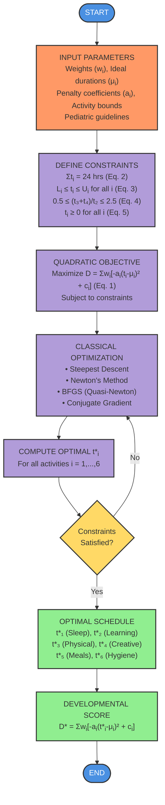

# Mermaid Flowchart Code

Copy this code and paste it into any of these tools:
- https://mermaid.live/
- https://mermaid.ink/
- GitHub markdown file



## Instructions:

### Option 1: Mermaid Live Editor (Easiest)
1. Go to: https://mermaid.live/
2. Paste the code above
3. Click "Download PNG" or "Download SVG"
4. Save as: `optimization_flowchart.png`

### Option 2: Using Node.js (If installed)
```bash
# Install mermaid-cli
npm install -g @mermaid-js/mermaid-cli

# Generate image
mmdc -i flowchart_mermaid.md -o optimization_flowchart.png -w 1200 -H 1600
```

### Option 3: GitHub Gist
1. Create a GitHub Gist with the mermaid code
2. Take a screenshot of the rendered diagram
3. Or use GitHub's raw view to export

The flowchart will have:
- Blue ovals for Start/End
- Orange for Input
- Purple for all Process steps
- Yellow diamond for Decision
- Green for Output/Results

